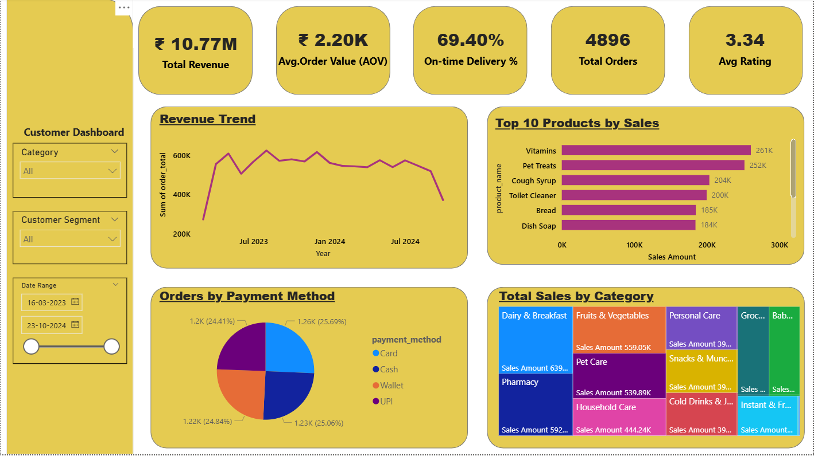

# Blinkit-E-commerce-Sales-Analysis-Power-Bi

### 🎯 Project Overview

This Power BI project provides a comprehensive analysis of Blinkit's e-commerce operations. The dashboard is designed to deliver actionable insights across three key business areas: customer behavior, sales performance, and delivery & marketing efficiency. The analysis leverages multiple datasets to create a unified view of the business, enabling data-driven decision-making.

---

### 📈 Key Features & Dashboards

#### **1. Customer Dashboard**

This dashboard provides a detailed look at the customer base, focusing on demographics, order history, and purchasing behavior. It includes key metrics such as total customers, average order value, and customer segmentation to help inform marketing strategies.

#### **2. Sales & Customer Insights**

This page is dedicated to analyzing sales trends and product performance. It identifies top-selling products, analyzes sales by category, and provides insights into customer spending habits. The dashboard helps to identify revenue drivers and optimize product offerings.

#### **3. Delivery & Marketing Dashboard**

This final dashboard monitors the efficiency of delivery operations and the effectiveness of marketing campaigns. It includes KPIs on on-time delivery rates, analyzes common reasons for delays, and provides a clear view of marketing ROI and conversions by channel. This helps the business optimize its logistics and marketing spend.

---

### 🛠️ Technology Stack

* **Data Visualization & Analysis:** Power BI Desktop
* **Data Transformation:** Power Query
* **Data Modeling & Measures:** DAX (Data Analysis Expressions)

### ✨ Key Insights

* **Customer Segmentation:** Identified key customer segments (e.g., Premium, Regular) and their purchasing patterns.
* **Operational Efficiency:** Pinpointed areas with longer average delivery times to help improve logistics.
* **Marketing Performance:** Analyzed campaign effectiveness and provided a clear view of ROI to optimize marketing spend.
